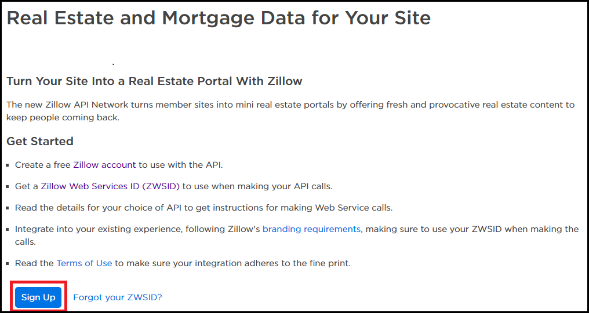
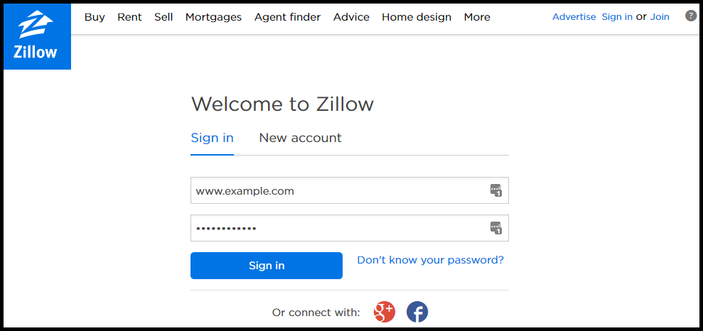
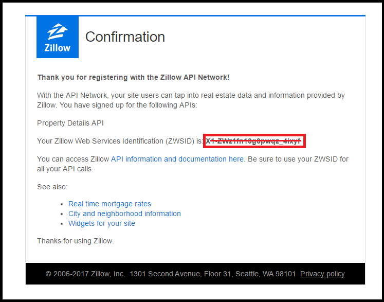
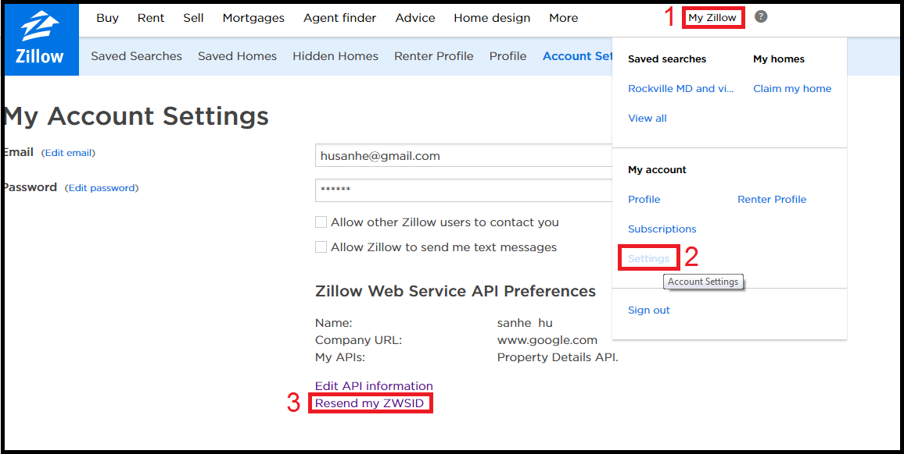
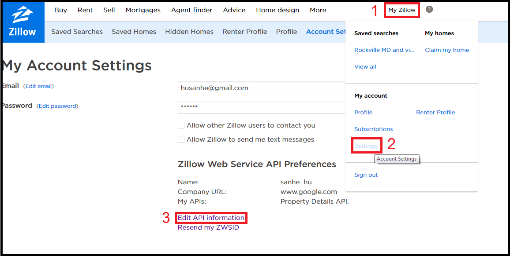
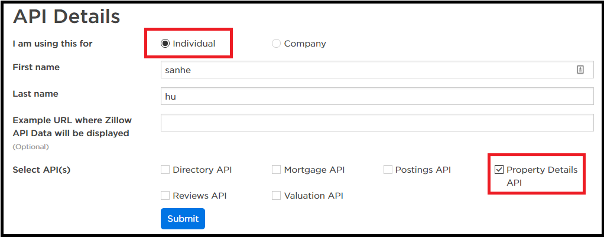

How to sign up a zillow API key?
===============================================================================
1. **Go to** `API Overview Page <http://www.zillow.com/howto/api/APIOverview.htm>`_, **Click** ``Sign Up``

2. Then it will pop up a window ask for a zillow account.

3. **Then go to the** `API Overview Page <http://www.zillow.com/howto/api/APIOverview.htm>`_, and click ``Sign-Up`` **Again it will pop up a window and ask for** (Sorry I don't have the screen shot):

- Choose: `I am using this for Individual`
- First, Last Name: just fill in your name.
- Example URL where zillow API Data will be displayed: Just enter any url, I use ``www.google.com``
- Select API: check ``Property Details API``. We don't need other API. But you could check anything you want.

4. Then you should received a confirmation email with ZWSID like this:

5. **Go to** `this Google Sheet <https://docs.google.com/spreadsheets/d/1mUN7gGPuEBjucukHSg5AXMKCUkoUuZd6P83_rONXH0U/edit?usp=sharing>`_ **and fill in your name and ZWSID**.

If you cannot find your ZWSID or didn't receive the email
-------------------------------------------------------------------------------
**Go to**: ``My Zillow`` - ``Settings``, **Click** ``Resend my ZWSID``, **then the ZWSID will go to your email**.

If you want to edit your API information:

1. **Go to**: ``My Zillow`` - ``Settings`` -> ``Edit API Information``

2. **Select** ``Individual``, **and** ``Property Detail API``.

